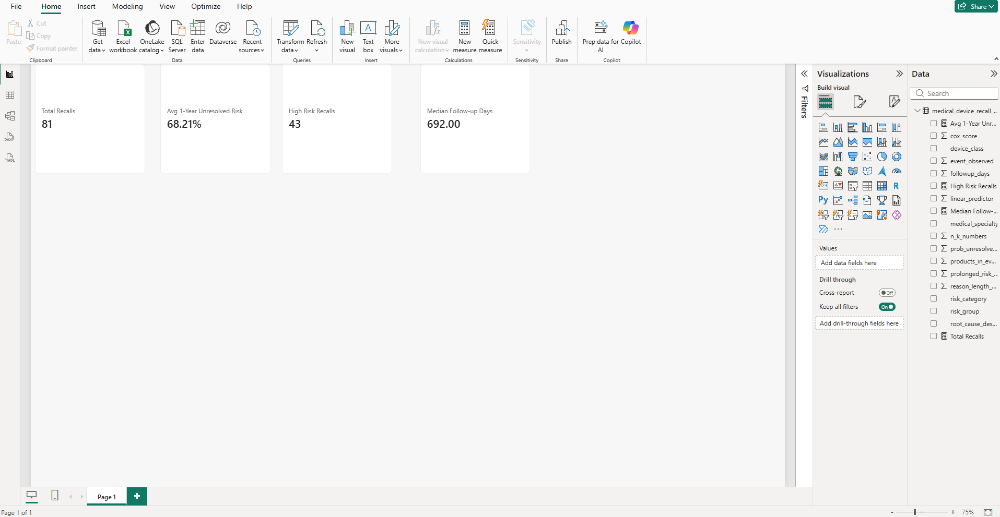

# Medical-Device-Recall-Risk-Business-Analytics

## Project Overview
This project analyzes medical device recall data to identify factors associated with prolonged recall resolution and predict the probability that recalls remain unresolved over time.

## Business Questions
Which device categories have the highest recall risk?
Which root causes are associated with longer resolution time?
Which recalls are most likely to remain unresolved after one year?
How can recall - risk results be communicated through business dashboards?

## Datasource
https://www.kaggle.com/datasets/kylefengkfeng209/medical-device-recall-survival-data

## Tools
- R
- Power BI
- Survival Analysis
- Kaplan - Meier Estimation
- Cox Proportional Hazards Regression

## Methods
- Data cleaning and exploratory analysis
- Kaplan - Meier survival analysis
- Cox proportional hazards modeling
- Predictive one - year unresolved recall probability
- Risk classification
- Power BI KPI dashboard

## Key Outputs
- Predicted recall risk
- One year unresolved probability
- High risk recall classification
- Recall risk by device class
- Recall risk by medical specialty
- Recall risk by root cause

## Visual Results

### Overall Recall Resolution
The Kaplan - Meier curve shows how the probability of a recall remaining unresolved changes over time

### Recall Resolution by Device Class
Recall - resolution curves were compared across device classes. The log-rank test showed no statistically significant difference between classes ( p = 0.53).

### Recall Resolution by Predicted Risk Group
Predicted risk groups showed clear differences in recall resolution time. High risk recalls remained unresolved longer than medium and low risk recalls, with significant differences across groups ( p < 0.0001).

## Dashboard
The Power BI dashboard includes:
1. Executive Overview
2. Predictive Risk Analysis
3. Recall Prioritization

# Dashboard Preview

## Author
Antonio Garcia
M.S. Applied Statistics
